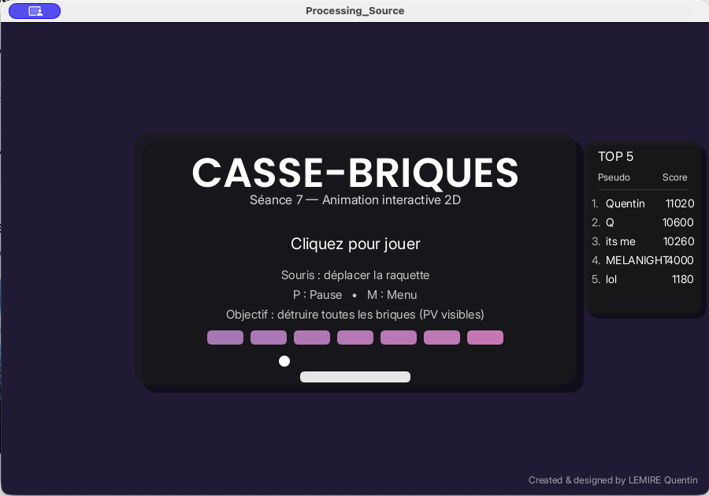
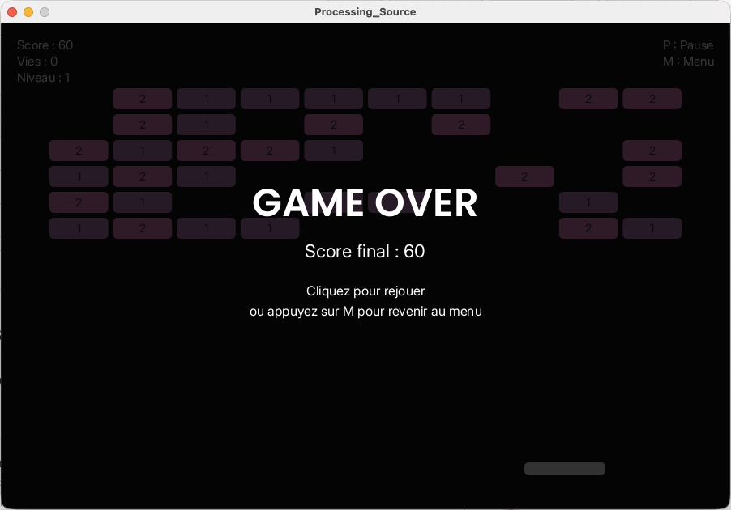
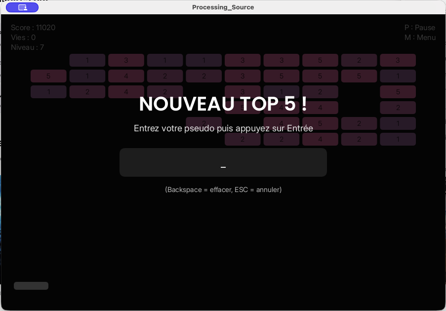

# 🧱🎮 Brick Breaker – Processing

Jeu de casse-briques interactif développé avec Processing (Java).

---

## 🚀 À propos du projet

Ce projet a été réalisé dans le cadre du module **MUX101 – Multimédia et interaction humain-machine**.

🎯 Objectif : concevoir un jeu 2D complet en exploitant :
- l’interaction utilisateur
- la logique de gameplay
- les collisions
- la programmation orientée objet

---

## 🎮 Gameplay

Le joueur contrôle une raquette à la souris pour renvoyer une balle et détruire toutes les briques.

👉 Le but : survivre, scorer et progresser à travers les niveaux.

---

## ⚙️ Fonctionnalités principales

- 🎯 Contrôle fluide de la raquette (souris)
- 🖱️ Lancement de la balle au clic
- 🔄 Rebonds réalistes (murs + raquette)
- 🧱 Briques avec points de vie
- ❤️ Gestion des vies
- 🏆 Système de score
- 📈 Progression par niveaux
- ⏸️ Pause du jeu
- 🎉 Écran de victoire
- 💀 Game Over

---

## ⚡ Bonus dynamiques

- 🔥 Multi-balle
- 📏 Agrandissement de la raquette
- ⚡ Accélération de la balle
- 🌩️ Bonus éclair
- ❤️ Vie supplémentaire

---

## 🔊 Expérience immersive

- Sons de collisions
- Effets sonores pour bonus
- Feedback audio victoire / défaite

---

## 🧠 Compétences développées

- Java / Processing
- Programmation orientée objet
- Gestion des collisions
- Animation 2D temps réel
- Interaction utilisateur (souris / clavier)
- Structuration d’un projet complexe
- Gestion de fichiers (classement TOP 5)

---

## 🏗️ Architecture du projet

Code organisé en plusieurs classes :
- 🎮 Gestion du jeu
- ⚽ Balles
- 🧱 Briques
- ⚡ Bonus
- 📊 Scores
- 🎵 Sons
- 📈 Niveaux

👉 Objectif : code clair, modulaire et maintenable

---

## ▶️ Lancer le jeu

1. Installer Processing  
2. Ouvrir le fichier principal `.pde`  
3. Cliquer sur **Run**

---

## 🎥 Aperçu du jeu

### 🎮 Gameplay

### 🧱 Menu

### 💀 Game Over

### 🏆 TOP 5

---

## 📚 Contexte pédagogique

Ce projet m’a permis de mettre en pratique :
- le déplacement d’objets en temps réel  
- les collisions  
- l’interaction utilisateur  
- la conception orientée objet  

👉 Un projet complet combinant logique, graphisme et interactivité.

---

## 💻 Code source

Le code source complet est disponible dans ce dépôt.

---
